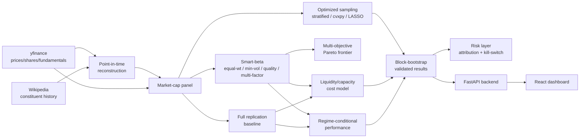

# IndexEdge — Index Replication & Smart-Beta Construction

S&P 500 replication and smart-beta construction, built on real market data end to end: point-in-time constituent reconstruction, three genuinely distinct optimized-sampling methods, four smart-beta variants, multi-objective portfolio construction, regime-conditional performance, capacity/liquidity-aware cost modeling, and block-bootstrap statistical validation. No synthetic data anywhere — every number in this README comes from real yfinance/Wikipedia data cached locally and computed by the code in this repository.

> **Status**: Backend, frontend, and research notebook all run against real cached data. 159 tests passing.
> **Live demo**: [indexedge.vercel.app](https://indexedge.vercel.app/) (backend on Render's free tier — may take ~20–30s to respond on first load after idle, since the instance spins down and needs to finish its one-time startup computation; see [Dashboard](#dashboard)).

---

## Table of Contents
1. [Motivation](#motivation)
2. [System Architecture](#system-architecture)
3. [Data](#data)
4. [Methodology](#methodology)
5. [Results](#results)
6. [Dashboard](#dashboard)
7. [Tech Stack](#tech-stack)
8. [Setup & Usage](#setup--usage)
9. [Limitations & Assumptions](#limitations--assumptions)
10. [Future Work](#future-work)
11. [Repository Structure](#repository-structure)

---

## Motivation

Most index-replication and smart-beta writeups either work from today's constituent list applied retroactively (silent survivorship bias) or present a single backtest run as if its Sharpe ratio were a fact rather than one draw from an uncertain distribution. This project is built to avoid both: constituent membership is reconstructed point-in-time from a real dated corporate-action log rather than assumed constant, and every headline number is reported with a block-bootstrap confidence interval rather than a bare point estimate.

The deeper goal is to test smart-beta's own textbook claims against real data rather than assume them: does low-volatility investing actually protect returns specifically when markets are stressed? Does a statistical-learning sampling method (LASSO) find a genuinely different reduced portfolio than direct convex optimization, or just a noisier version of the same one? Does any smart-beta variant's edge survive real trading costs at institutional size? All three questions get a direct, numeric answer in [Results](#results) — including where the answer is "no" or "it's more complicated than that."

---

## System Architecture



---

## Data

All real, no synthetic fixtures in production code paths (tests use synthetic data deliberately, for exact-answer correctness checks — see [Setup & Usage](#setup--usage)).

- **Point-in-time constituent membership** (`data/wikipedia_constituents.py`, `replication/point_in_time.py`): Wikipedia's "List of S&P 500 companies" page carries both the current constituent list and a dated "Selected changes to the components" log back to 1976-07-01. Rather than applying today's 503 names to the whole backtest history, membership at any past date is reconstructed by rolling the current list backward through that log, event by event, in strict reverse-chronological order (required for correctness when a name was both added and removed before the target date). Validated against a real historical fact: Tesla was not in the index on 2020-01-01 and was by 2021-01-01 (it joined December 2020) — both directions are covered by tests, plus 5 more synthetic edge cases.
- **Prices, shares outstanding, fundamentals** (`data/prices.py`, `data/shares_outstanding.py`, `data/fundamentals.py`): yfinance, cached per-symbol to local parquet. 611 of 708 point-in-time constituents (2016–2026 universe) have fetchable price history — the other 97 are real acquisitions/delistings (CELG, ATVI, TWTR, XLNX, SIVB, FRC, and others) yfinance no longer serves, disclosed via a `missing` list every fetch function returns rather than silently dropped.
- **Index levels**: both `^GSPC` (price-only) and `^SP500TR` (total-return) are fetched, since full replication's simulated returns include reinvested dividends (via yfinance's split/dividend-adjusted close) and comparing that against a price-only index would fabricate a spurious performance gap — an early real bug in this project, caught and fixed (see `replication/full_replication.py`).
- **A real yfinance bug found and fixed along the way**: `get_shares_full()` returns the company-wide *combined* share count identically for each class of a multi-class company (GOOGL/GOOG, FOX/FOXA, NWS/NWSA), roughly doubling that company's computed weight if used naively. Fixed by rescaling each symbol's historical share series against a same-day class-specific anchor from `Ticker.info['sharesOutstanding']` — see `data/shares_outstanding.py`'s docstring for the full diagnosis and `tests/replication/test_market_cap.py` for the regression test.

---

## Methodology

### Full replication baseline
Cap-weighted holdings of every point-in-time constituent, rebalanced on the real quarterly schedule (third Friday of March/June/September/December), using real historical shares outstanding rather than today's share count applied retroactively. Tracking error against real ^GSPC/^SP500TR is small but not literally zero (~1.9% annualized) — proven via a synthetic exact-match test (`tests/replication/test_full_replication.py`) that the simulation mechanics themselves are correct, with the residual real-data tracking error attributed to disclosed, quantified causes: a free-float proxy (`sharesOutstanding` vs. the S&P's own official investable-weight factor) and the 86% price-history coverage above. Tracking error falls to ~1.2% in the highest-coverage recent years, directly confirming coverage as a real contributor.

### Optimized sampling
Three genuinely different methods for approximating full replication with fewer names, all walk-forward validated (fit on trailing data, evaluated strictly out-of-sample across 37 real rebalance dates — proven lookahead-free by a dedicated test that perturbs future prices and confirms past decisions don't change):
- **Stratified** (`replication/stratified.py`): GICS sector × market-cap-tercile buckets, no return data used at all.
- **Optimization** (`replication/optimized_sampling.py`): a `cvxpy` convex QP minimizing tracking-error variance over a market-cap-preselected candidate set.
- **LASSO** (`replication/lasso_sampling.py`): L1-regularized regression over the *full* membership (no preselection) — sparsity emerges endogenously from the regularization path.

### Smart-beta
Four variants (`smartbeta/`): equal-weight (no data), minimum-volatility (Ledoit–Wolf shrunk covariance QP, methodology reused directly from RiskDesk), quality-weighted (standalone weighting by a fundamentals composite: profitability, low leverage, earnings growth), and a multi-factor tilt (cap-weights tilted by an IC-weighted composite of momentum/low-vol/value/quality, combination methodology adapted from alpha-signal-lab's walk-forward IC weighting).

### Multi-objective optimization
Jointly balances tracking error, turnover, and factor exposure in one convex problem (`replication/multi_objective.py`) via an epsilon-constraint formulation — chosen over weighted-sum scalarization because tracking-error-variance terms (~1e-4–1e-6) and L1 turnover terms (~O(1)) live on scales too different for an unnormalized weighted sum to trace a meaningful frontier. Proven correct via the property that must hold for any valid convex epsilon-constraint solve: relaxing the turnover budget can never *increase* the achieved tracking error.

### Regime-conditional performance
Calm/normal/volatile classification via rolling realized-volatility terciles, methodology reused directly from RiskDesk (itself adapted from ExecEdge), classified on the real S&P 500 index level rather than a proxy ETF. Used to test the low-volatility anomaly's own stated rationale directly — see [Results](#results).

### Liquidity & capacity
Real transaction-cost modeling (`liquidity/`) via the square-root-law market-impact formula, reused directly from ExecEdge's own disclosed calibration (`cost_fraction = Y · σ · √(participation_rate)`, `Y=1.0` kept as ExecEdge's own "textbook order-of-magnitude" convention, not fitted here). Applied across every real portfolio rebalance transition, not just a single snapshot, to produce genuine cost-adjusted return series.

### Statistical validation
Circular block bootstrap (`backtest/bootstrap.py`), methodology ported directly from PairTrade Lab/BookMaker/ExecEdge's own established statistical-rigor standard (`block_length=20`, `n_resamples=2000`, percentile confidence intervals) — validated here against a synthetic AR(1) series with known autocorrelation, confirming the block bootstrap preserves it while a naive i.i.d. bootstrap destroys it almost entirely.

### Risk layer
Brinson–Fachler active-risk decomposition (`risk/attribution.py`) — sector allocation vs. security selection vs. interaction, reconciling *exactly* to total active return by algebraic identity (not a regression residual "plugged" to force reconciliation). A benchmark-relative kill-switch (`risk/kill_switch.py`, sticky/manual-reset pattern reused from RiskDesk) trips on a 5% annualized tracking-error limit or a 10% maximum relative-drawdown limit (measured from the true historical high-water mark, not just the current value — an early version of this check only looked at the current day and would have let a switch silently "un-trip" after a recovery).

---

## Results

Every number below has a 95% block-bootstrap confidence interval attached in the underlying data (`results/output/full_results.csv`); the summary here states point estimates plus what the interval actually supports.

**Does any smart-beta variant beat cap-weighted full replication once real costs are included?** Quality-weighted does, at every AUM level tested (+3.06% at $10M, +2.93% at $100M, +2.50% at $1B annualized, after costs). Multi-factor tilt also beats it on a point-estimate basis. Minimum-volatility's confidence interval spans zero at every AUM level — "beats" or "loses to" full replication on a point estimate alone overstates the certainty; the bootstrap says min-vol's true cost-adjusted return at realistic size is not reliably distinguishable from full replication's, or from zero.

**Does regime-conditioning show low-vol's edge is real but regime-specific, or does it wash out?** Neither — it inverts. Minimum-volatility's realized volatility genuinely is lowest of all five variants compared, in every regime (calm/normal/volatile alike) — the risk-reduction design goal holds up on real data. But its *return*, relative to full replication, is worst specifically in the volatile regime (-8.30% at $10M AUM, widening to -26.92% at $1B as capacity costs compound with the regime effect), and its Sharpe ratio there (0.50) is the lowest of all five variants — the opposite of the textbook low-volatility-anomaly claim that low-vol should hold up, or outperform, specifically when markets are stressed. In this real backtest, it does not.

**Does the ML-based (LASSO) sampling method meaningfully differ from direct optimization?** Yes, in both directions. On tracking error alone, LASSO starts markedly worse than direct convex optimization at low name counts (12.2% mean out-of-sample TE at N=30 vs. optimization's 3.2%, from L1 shrinkage bias under a tight sparsity budget), closing most of the gap by N≈100 (TE gap narrows to +1.88%). But on realized turnover and cost, LASSO's turnover is nearly double optimization's at the same name count, translating to a materially larger annualized cost drag at realistic AUM — so even where LASSO looks competitive on tracking error, it is a genuinely different, and at realistic scale costlier, portfolio, not just a noisier estimate of the same one. A real mathematical property, not a tuning choice: LASSO's achievable name count is bounded by the trailing lookback window's sample size (~252 observations), so its curve is only directly comparable to the other methods up to roughly that ceiling.

Reproduce the full table (strategy × AUM × regime, with confidence intervals) and the programmatically-derived findings above with:

```bash
python -m results.run_full_comparison
```

---

## Dashboard

Two presentation layers over the same real computation, not two separate implementations:

- **Backend API** (`backend/main.py`): FastAPI, one endpoint per analytical module, thin wrappers with no computation duplicated from the modules they expose. The shared backtest pipeline is computed once at process startup (not per-request) since — unlike a live-positions backend — nothing about this project's cached historical data changes during the server's lifetime. The one exception: `/api/results` serves `results/run_full_comparison.py`'s precomputed output rather than recomputing live, since that computation (2000-resample bootstraps × 3 AUM levels × 5 strategies) genuinely takes over a minute.
- **Frontend** (`frontend/`): React + TypeScript + Vite + Recharts, conventions (Card component, typed API client, CSS-custom-property theming with light/dark support) mirrored from alpha-signal-lab's own dashboard. Six views: replication summary, sampling tracking-error-vs-name-count curve, multi-objective Pareto frontier, smart-beta comparison with regime breakdown, capacity/kill-switch/attribution, and the full results table with confidence intervals.

**Running locally**: `uvicorn backend.main:app --reload` (backend, ~20–25s startup once data is cached) + `cd frontend && npm install && npm run dev` (frontend, reads `VITE_API_BASE_URL` from `frontend/.env`).

**Deploying** (Render for the backend, Vercel for the frontend — both auto-deploy from GitHub on every push once connected):

1. Push to GitHub (or use an existing remote — `git remote -v` to check).
2. **Backend, Render**: [dashboard.render.com](https://dashboard.render.com) → New → Blueprint → connect the repo. Render reads `render.yaml` and provisions the `indexedge-api` web service automatically (no manual config needed). First deploy's build step also fetches real data (`python -m data.run_ingest`, ~5–6 min — see `render.yaml`'s own comments for the tradeoff this implies), then the server itself takes another ~20–25s to finish its one-time startup computation before `/health` responds. Leave `ALLOWED_ORIGINS` unset for now. Once live, copy the service URL (`https://indexedge-api.onrender.com`-style) and confirm with `curl <url>/health`.
3. **Frontend, Vercel**: [vercel.com/new](https://vercel.com/new) → import the same repo → set **Root Directory** to `frontend`. Vercel auto-detects the Vite app; no build-command changes needed. Add an environment variable `VITE_API_BASE_URL` set to the Render URL from step 2, then deploy. Copy the resulting Vercel URL.
4. **Close the loop**: back on Render, set the `indexedge-api` service's `ALLOWED_ORIGINS` env var to the Vercel URL (comma-separated if there's more than one, e.g. a preview + production URL), which triggers a redeploy to pick it up.
5. Open the Vercel URL and confirm the dashboard loads real data with no CORS errors in the browser console. Render's free tier spins down after inactivity, so the first request after idle time re-pays the ~20–25s startup cost from step 2.

---

## Tech Stack

- **Data & research**: Python 3.11, Pandas, NumPy, SciPy, scikit-learn, `cvxpy`, `statsmodels`, yfinance
- **Backend API**: FastAPI (`backend/main.py`), deployed on Render
- **Dashboard**: React + Vite + TypeScript + Recharts (`frontend/`), deployed on Vercel
- **Deployment**: Render (backend, via `render.yaml`, data fetched at build time), Vercel (frontend)
- **Storage**: local parquet cache (`data/cache/`), no database — this project's entire dataset is a fixed historical window, recomputed in-process rather than persisted externally

---

## Setup & Usage

```bash
git clone <repo-url>
cd indexedge
python3.11 -m venv .venv && .venv/bin/pip install -r requirements.txt

# Fetch real data (Wikipedia constituents/changes, prices, shares outstanding, fundamentals) --
# cached to data/cache/, only re-fetches what's missing on subsequent runs
.venv/bin/python -m data.run_ingest --start 2016-01-01 --end 2026-08-07

# Run the research notebook
jupyter notebook notebooks/research.ipynb

# Run any individual analysis
.venv/bin/python -m replication.run_full_replication
.venv/bin/python -m replication.run_sampling_comparison
.venv/bin/python -m replication.run_multi_objective
.venv/bin/python -m regime.run_regime_conditional
.venv/bin/python -m liquidity.run_capacity_analysis
.venv/bin/python -m backtest.run_bootstrap_backtest
.venv/bin/python -m risk.run_risk_layer
.venv/bin/python -m results.run_full_comparison

# Run the test suite (150 tests: mostly synthetic fixtures for exact-answer
# correctness checks -- known optimal solutions, algebraic identities,
# monotonicity properties; data/ tests mock network calls; tests/backend/
# exercises the real FastAPI app against real cached data)
.venv/bin/pytest

# Launch the backend + frontend
uvicorn backend.main:app --reload
cd frontend && cp .env.example .env && npm install && npm run dev
```

---

## Limitations & Assumptions

Being upfront about these matters more than hiding them — a reviewer who catches an unstated assumption will trust the rest of the results less.

- **Pre-1976 survivorship bias is not corrected.** Point-in-time reconstruction relies on Wikipedia's changes log, which starts 1976-07-01; dates before that fall back to today's constituent list, so the survivorship bias this project exists to reduce is *not* reduced for the earliest possible backtest dates.
- **Pure ticker/company renames not logged as an explicit add+remove pair are invisible to the reconstruction** — a real, unquantified gap in the point-in-time membership.
- **Fundamentals are a current snapshot, not point-in-time historical.** yfinance exposes no historical fundamentals API, so quality/value factor construction implicitly uses look-ahead information (today's ROE/margin profile) at every historical rebalance — disclosed explicitly rather than presented as point-in-time-correct the way membership reconstruction is.
- **86% price-history coverage**, not 100% — 97 of 708 point-in-time constituents (2016–2026) have no reachable yfinance history, real acquisitions/delistings, not silently dropped but also not recoverable from this data source.
- **Free-float proxy, not the S&P's official float.** `sharesOutstanding` is used as a proxy for the S&P's own investable-weight-factor float, a disclosed approximation.
- **Square-root-law impact model with an unfitted constant.** `Y=1.0` is ExecEdge's own disclosed "textbook order-of-magnitude" convention (independent studies converge on roughly 0.5–1.5), not a value fitted to this project's own data — real transaction costs could plausibly be meaningfully higher or lower than modeled.
- **Cost timing is an instantaneous-hit approximation.** Rebalancing costs are applied to the first trading day at/after a rebalance, not spread across real intraday execution, since this project has no intraday data.
- **Block bootstrap's `block_length=20` is a disclosed, unfitted parameter** — chosen for the standard bias/variance tradeoff reasoning (too short degenerates toward a naive i.i.d. bootstrap; too long leaves too few independent blocks to vary across resamples), not tuned to this project's own return series.

---

## Future Work

- True point-in-time fundamentals from a paid data provider, if ever accessible, to remove the current-snapshot look-ahead in quality/value factor construction.
- An ESG-tilted smart-beta variant, using the same IC-weighted composite-tilt machinery already built for the multi-factor variant.
- A live paper-trading extension, applying the same walk-forward-fit weight construction to real-time data on a scheduled basis, following the same disclosed-limitations discipline as the backtest.
- Extend the Brinson–Fachler attribution to a full historical time series (currently one representative period) for a rolling active-risk-decomposition view.
- Real, fitted (not textbook-convention) market-impact coefficients, if a data source with actual equity trade-level fill data becomes accessible.

---

## Repository Structure

```
indexedge/
├── data/               # Wikipedia constituents/changes, prices, shares outstanding, fundamentals — all cached to data/cache/
├── replication/        # point-in-time reconstruction, full replication, optimized sampling, multi-objective optimization
├── smartbeta/          # equal-weight, min-vol, quality, multi-factor tilt, shared simulation loop
├── regime/             # calm/normal/volatile classification, regime-conditional performance
├── liquidity/          # square-root-law market-impact cost model, capacity analysis
├── costs/              # applies liquidity's cost model across a full backtest's rebalance history
├── backtest/           # performance metrics, circular block bootstrap, consolidated results runner
├── risk/               # tracking error, Brinson-Fachler attribution, benchmark-relative kill-switch
├── results/            # consolidated strategy x AUM x regime comparison table + derived findings
├── backend/            # FastAPI app behind the React dashboard, deployed on Render
├── frontend/           # React + Vite + TypeScript dashboard, deployed on Vercel
├── notebooks/          # research.ipynb (pre-executed against real data)
├── tests/              # mirrors the module structure above; data/ tests mock network calls
├── render.yaml         # Render Blueprint: FastAPI service, data fetched fresh at build time
├── requirements.txt
└── README.md
```
